<p align="center">
  <a href="https://github.com/QPSC-Design/PSC-ONE">
    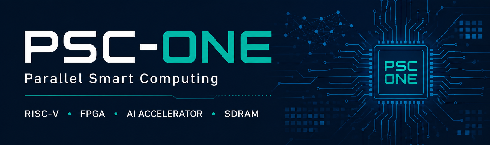
  </a>
</p>

# PSC-ONE SoC

An open-source full-stack RISC-V SoC platform for FPGA-based edge computing and AI acceleration.  
PSC-ONE integrates a custom CPU, memory subsystem, peripherals,
operating system, and AI accelerator into a unified architecture,
enabling end-to-end hardware/software co-design.

The PSC-NPU (SynapEngine) accelerator is controlled directly through custom
RISC-V CSR registers and accesses matrix data through the shared
cache/memory subsystem. This reduces explicit data transfers and
redundant memory copies during matrix operations and future neural-network workloads.
  
The current PSC-ONE prototype hardware.  
  
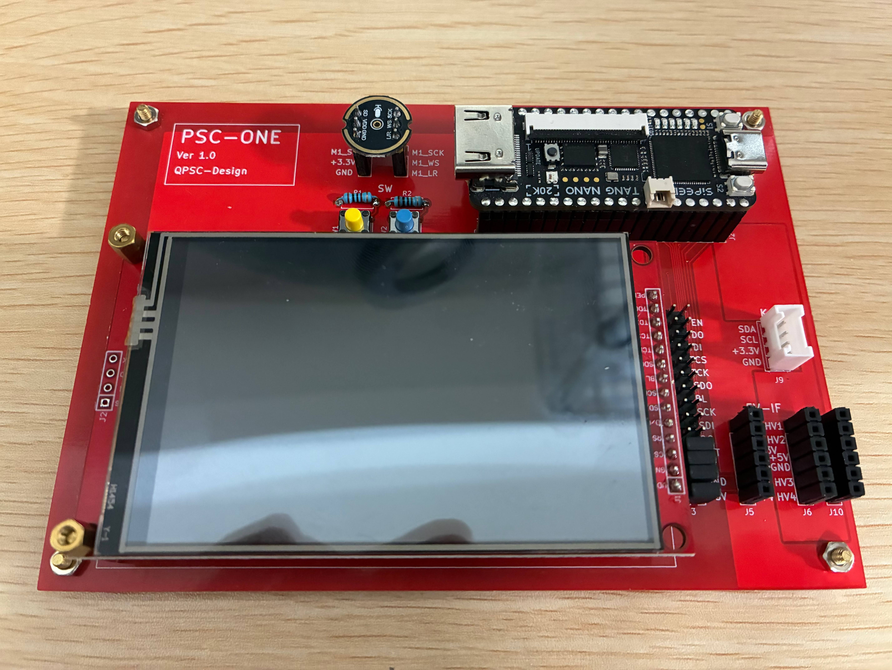

The displayed color bars are generated directly by the PSC-ONE hardware and confirm correct operation of the LCD subsystem.　

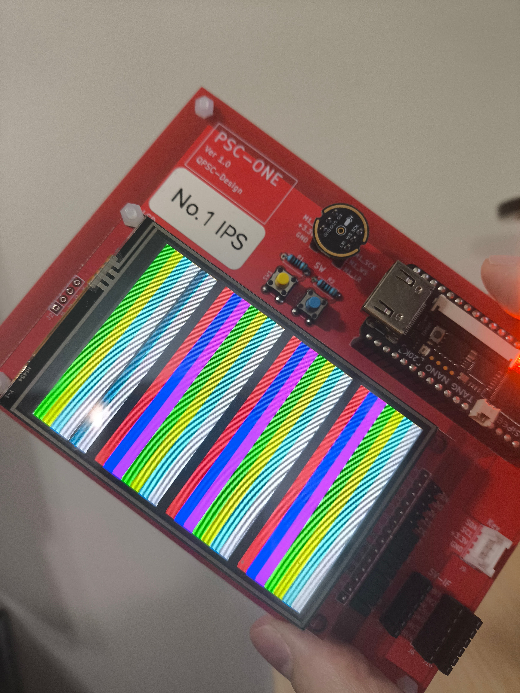

The PSC-ONE boot logo rendered on the actual FPGA hardware during system startup, demonstrating successful LCD initialization and graphics output.  

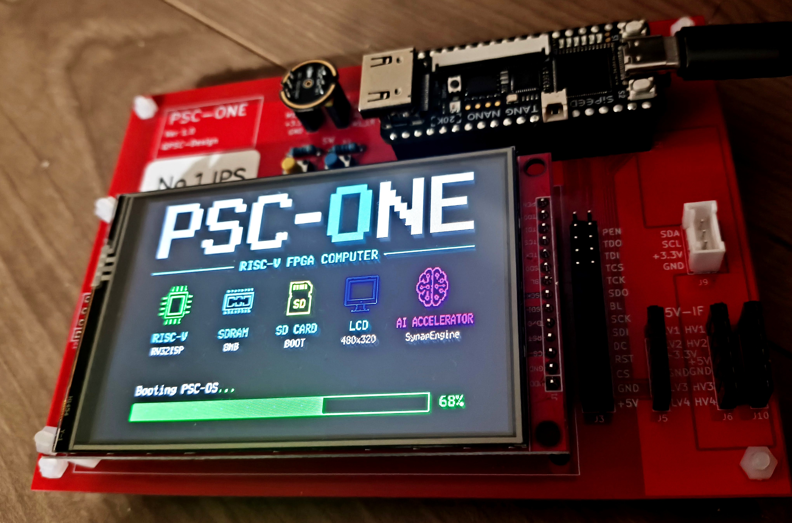

## What is PSC-ONE?

PSC-ONE is an open-source full-stack RISC-V SoC project developed by QPSC-Design.

It aims to build a fully custom edge computing platform from the ground up, including the following components:

- A custom RV32-based RISC-V CPU core
- A memory subsystem, including an SDRAM controller, caches, and an Sv32 MMU
- An SD card boot and storage interface
- Memory-mapped peripheral interfaces
- An AI acceleration engine, PSC-NPU, based on a systolic array architecture
- A custom operating system, PSC-OS

PSC-ONE is not just a CPU core, but a complete experimental SoC platform for research, edge AI development, and architectural exploration.

---

## PSC-ONE SoC Architecture

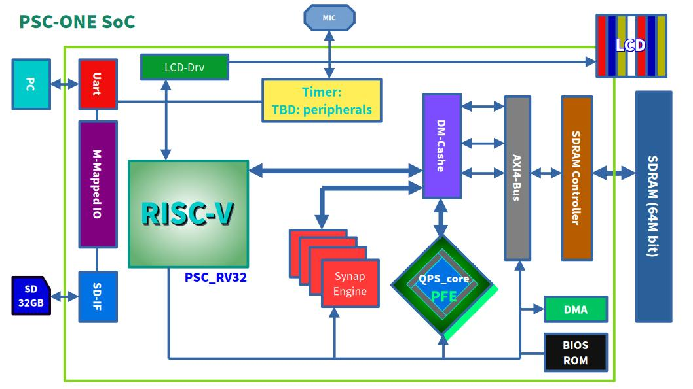

This section presents the overall PSC-ONE SoC architecture, including the
PSC_RV32 CPU, memory subsystem, peripherals, PSC-OS, and PSC-ONE AI.

---

## Repository Structure

- `hardware/` - FPGA RTL design, including the CPU core, memory subsystem, and peripherals
- `software/` - PSC-OS, boot code, and user-side software
- `docs/` - Architecture diagrams and supporting documentation

---

## Hardware Components

The hardware side of PSC-ONE currently includes:

- `PSC_RV32` custom RISC-V CPU core
- SDRAM controller
- SD card interface (SPI mode)
- Memory-mapped peripheral system
- PSC-NPU (SynapEngine) AI accelerator

---

## Software Stack

The software side of PSC-ONE currently includes:

- `PSC-OS`, a custom operating system for the platform
- Boot and initialization flow for FPGA-based execution
- User programs and runtime experiments, including UART-based output demos

---

# CPU (PSC_RV32)

## CPU Architecture

This diagram presents the top-level architecture of the PSC system.  
It shows how the PSC_RV32 CPU core is integrated with memory and peripheral components, including UART, SDRAM, and the SD card interface.  
Most peripherals are connected through memory-mapped interfaces.
The PSC-NPU accelerator is controlled directly through custom RISC-V
CSR registers and accesses matrix data through the shared cache/memory subsystem.
  
A key feature of the PSC architecture is the tightly coupled integration of the PSC-NPU accelerator with the CPU.  
Both the PSC_RV32 core and the PSC-NPU access memory through
the shared cache and memory subsystem.
Unlike loosely coupled accelerator designs that require explicit DMA transfers
for every operation, PSC-NPU can directly access data through the shared
cache/memory subsystem, reducing redundant memory copies.
  
This tightly coupled architecture improves overall efficiency by reducing memory access overhead and is particularly suitable for data-intensive workloads such as matrix operations and future neural-network inference.

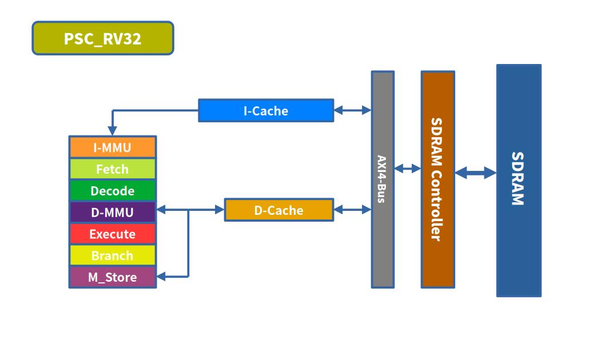

Current CPU features include:

* RV32I base integer instruction set
* Zicsr CSR instructions
* Zifencei instruction support
* Integer multiplication support
* Integer division and remainder support
* Machine, Supervisor, and User privilege modes
* Exception and interrupt handling
* ECALL and SRET support
* Sv32 virtual memory
* Instruction and data caches
* Load-use and register-dependency handling
* Optional pipelined execution
* Custom hardware-accelerator integration

---

# CPU (PSC_RV32_V1)

## CPU Architecture

The following diagram shows the internal architecture of the PSC_RV32_V1 CPU and its connection to the PSC-ONE memory subsystem.

PSC_RV32_V1 is a redesigned version of the original PSC_RV32 processor.  
Its execution logic is divided into independent functional modules, including instruction fetch, decode, arithmetic execution, branch processing, memory access, CSR control, and register write-back.

A central control unit dispatches operations to these modules and waits for their completion.  
This task-oriented organization replaces a tightly coupled monolithic state machine with a clearer and more modular architecture.

Instruction control information generated by the decoder is transferred between modules using a packed SystemVerilog structure.  
This reduces the number of individual control signals and makes the CPU easier to extend and maintain.

The CPU currently operates as a multi-cycle state-machine processor.  
However, the separation of execution modules provides a foundation for future pipelined execution, multiple instruction slots, and multithreaded operation.

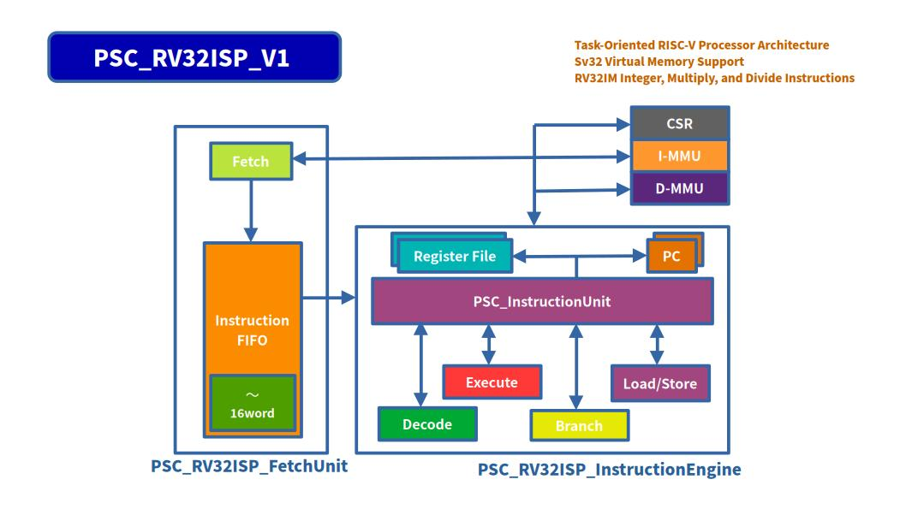

The task-driven design provides:

* Clear separation between functional modules
* Explicit control of instruction execution order
* Support for variable-latency execution units
* Simple cache and MMU wait-state handling
* Unified handling of branches, loads, stores, CSR operations, and exceptions
* A foundation for multiple execution slots and limited parallel execution
* Easier extension with custom PSC-ONE hardware accelerators

PSC_RV32_V1 currently uses a state-controlled execution model. Future versions may hold multiple instruction tasks simultaneously and permit independent tasks to overlap when there are no register, memory, or control dependencies.

---

# CPU (PSC_RV32_V2)

## Experimental Dual-Issue / Out-of-Order Architecture

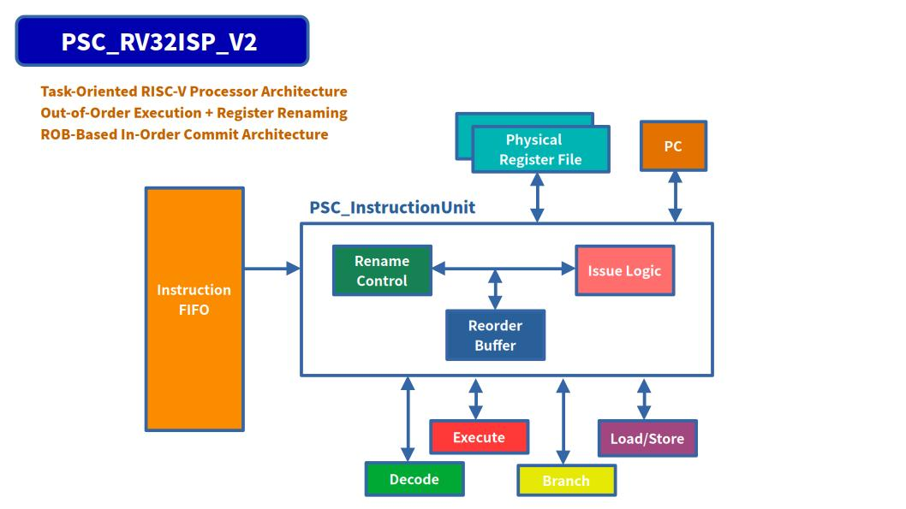

`PSC_RV32_V2` is an experimental CPU architecture derived from `PSC_RV32_V1`.

While V1 uses a state-controlled execution model in which instruction processing is largely serialized, V2 explores overlapping instruction execution, dual instruction slots, register renaming, and limited out-of-order execution.

The primary goal of V2 is not to build a large superscalar processor, but to investigate how much instruction-level parallelism can be introduced into a small FPGA-oriented RISC-V CPU with relatively simple hardware.

The current development focuses on allowing Fetch, Decode, Execute, and Commit operations to overlap instead of waiting for each instruction to complete the entire execution sequence.

### Architecture Goals

The V2 architecture explores:

* Dual instruction slots
* Overlapped Fetch / Decode / Execute / Commit
* Limited out-of-order execution
* In-order retirement
* Register renaming
* Register dependency detection
* RAW / WAR / WAW hazard handling
* Independent execution of instructions without dependencies
* Variable-latency execution units such as MUL / DIV / REM
* Forwarding between pipeline stages
* Pipeline stalls and bubbles when dependencies cannot be resolved

A particularly important target is hiding the latency of long-running operations.

For example, when a DIV or REM instruction is waiting for completion, an independent arithmetic instruction may be allowed to execute first. Architectural state is still committed in program order so that externally visible CPU behavior remains consistent with sequential RISC-V execution.

### FPGA-Oriented Design

Unlike large commercial out-of-order processors, PSC_RV32_V2 intentionally keeps the scheduling window and execution resources small.

The design is intended for FPGA implementation and therefore prioritizes:

* Small scheduling logic
* Limited instruction window
* Simple dependency checking
* Minimal register-renaming hardware
* Low LUT and flip-flop overhead
* Short timing-critical paths
* Compatibility with the existing PSC-ONE cache, MMU, and memory subsystem

Load/store, branch, CSR, exception, and other complex operations may still be serialized when required.

The architecture is being developed incrementally: first overlapping simple R/I-type instructions, then extending parallel execution to MUL/DIV and other instruction classes while continuously verifying compatibility with the existing CPU.

## Verification

PSC_RV32_V2 is verified using the same simulation infrastructure as V1, including Verilator, cocotb, and the official RISC-V ISA tests.

The development requirement is that architectural optimizations must not break the existing instruction tests.

The main regression tests are:

```text
make -f Makefile.riscv.sim simulate_RISCV_TESTS_PARALLEL CPU_VERSION=v2

make -f Makefile.cpu.core simulate_CPU_CORE CPU_VERSION=v2
```

V2 remains an experimental architecture and is actively being refined.

The long-term objective is to determine how far a relatively small FPGA RISC-V processor can move from a traditional multi-cycle CPU toward a lightweight superscalar / out-of-order architecture without introducing the complexity of a modern high-performance desktop CPU.


## RISC-V ISA Test Results

The `PSC_RV32_V1` processor has been verified using the official `riscv-tests` instruction test suite.

The following test groups currently pass in Verilator and cocotb simulation:

* RV32I base integer instruction tests
* RV32M multiplication, division, and remainder tests
* Load and store instruction tests
* Branch and jump instruction tests
* Shift and comparison instruction tests
* `FENCE.I` instruction test

A total of **49 official RISC-V ISA tests pass** on `PSC_RV32_V1`.

The `rv32ui-ma_data` test is currently excluded because it requires misaligned data access support. PSC_RV32_V1 currently expects naturally aligned load and store accesses.

Test sources are based on:

```text
https://github.com/riscv-software-src/riscv-tests
```

The tests are executed using:

```text
Verilator
cocotb
RISC-V GNU Toolchain
```


---

## PSC_RV32 vs PicoRV32 (Yosys Analysis)

### Resource Comparison

| Metric           | PSC_RV32             | PicoRV32 |
|------------------|----------------------|----------|
| Cells            | 1385                 | 515      |
| Adders           | 15                   | 8        |
| Subtractors      | 4                    | 3        |
| Multipliers      | **3**                | **0**    |
| Multiplexers     | 377                  | 148      |
| Comparators      | 354                  | 69       |
| Registers (FF)   | 217                  | 105      |

---

## Architectural Features

| Feature                       | PSC_RV32    | PicoRV32 |
| ----------------------------- | :---------: | :------: |
| RV32I                         |      ✓      |     ✓    |
| Zicsr / CSR Support           |      ✓      | Optional |
| RV32M MUL/DIV/REM             |      ✓      | Optional |
| Privilege Modes (M/S/U)       |      ✓      |     ✗    |
| Sv32 MMU                      |      ✓      |     ✗    |
| Instruction FIFO              |      ✓      |     ✗    |
| Fetch/Execute Separation      |      ✓      |     ✗    |
| RAW Hazard Detection          |      ✓      |     ✗    |
| Load-Use Stall                |      ✓      |     ✗    |
| Pipeline Execution            |   Partial   |     ✗    |
| Instruction Cache             |      ✓      |     ✗    |
| Data Cache                    |      ✓      |     ✗    |

> Resource counts are based on generic Yosys RTL cells before FPGA
> technology mapping. PicoRV32 results depend on the selected configuration.
> Multiplexer counts include Yosys `$mux` cells only and exclude `$pmux` cells.

---

# PSC-ONE AI

PSC-ONE AI is a hardware accelerator platform for matrix multiplication (GEMM),
built around a custom systolic-array architecture.

It is part of the broader PSC-ONE experimental SoC platform,
which integrates:

- Custom RISC-V CPU
- Memory subsystem
- AI accelerator
- Hardware/software co-design environment

The project focuses on exploring efficient dataflow architectures
under constrained memory bandwidth for edge AI systems.

---

## PSC-ONE AI Architecture

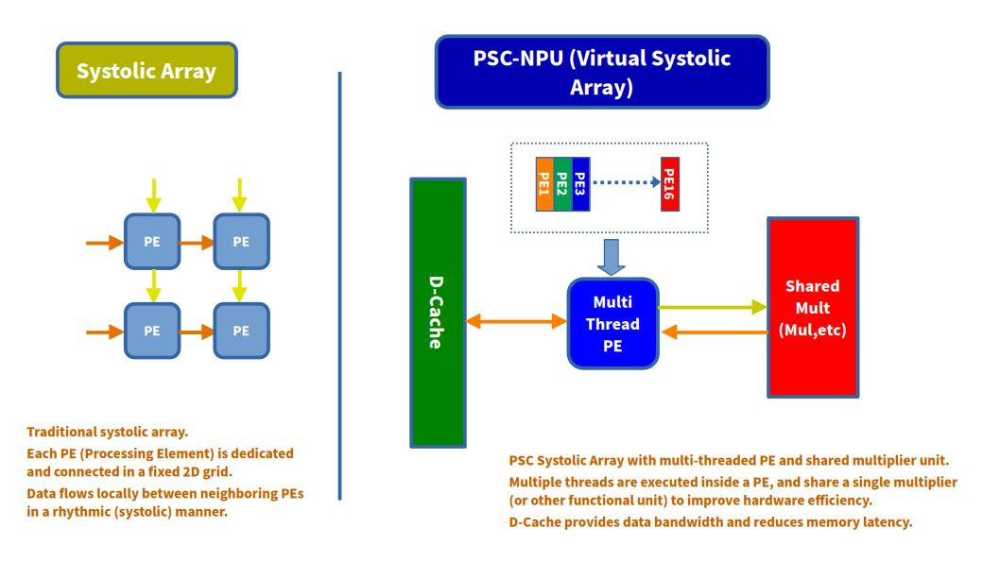

The system integrates the PSC-NPU systolic array
with the PSC-ONE SoC platform.

---

## PSC-ONE AI Features

- 4×4 INT8 systolic array
- Output-Stationary (OS) dataflow
- Direct control through custom RISC-V CSR registers
- Direct matrix data access through the CPU cache/memory subsystem
- Integrated with the custom PSC-RV32 processor
- Experimental hardware/software co-design platform

---

## 8×8 Matrix Multiplication Performance

The following results compare the execution time of an 8×8 matrix multiplication across different PSC-RV32 configurations and the systolic array accelerator.

### Execution Time Comparison

| Configuration                                  | Execution Time | Performance vs. V1 |
| ---------------------------------------------- | -------------: | -----------------: |
| PSC_RV32                                       |         591 µs |       ~1.80× faster |
| PSC_RV32_V1                                    |        1066 µs |           Baseline |
| Systolic Array                                 |          44 µs |       ~24.2× faster |
| PSC_RV32_V1 (Fetch FIFO enabled)               |         742 µs |       ~1.44× faster |
| PSC_RV32_V1 (R/I-Type pipeline enabled)        |         651 µs |       ~1.64× faster |

### Results

The systolic array completed the 8×8 matrix multiplication in **44 µs**, approximately **24.2× faster** than the baseline PSC_RV32_V1 processor.

Enabling the Fetch FIFO reduced the PSC_RV32_V1 execution time from **1066 µs to 742 µs**. Enabling the R/I-Type pipeline further reduced it to **651 µs**, approaching the performance of the original PSC_RV32 processor at **591 µs**.

These results demonstrate that both instruction-fetch optimization and R/I-Type pipelining significantly improve CPU performance. However, the dedicated systolic array still provides a much larger performance advantage for matrix multiplication workloads.

---

## PSC-NPU and PicoRV32 Resource Scale Comparison

### Resource Comparison

| Metric         | PSC-NPU (4×4)        | PicoRV32 |
| -------------- | -------------------: | -------: |
| Cells          |                  555 |      515 |
| Multipliers    |                **2** |    **0** |
| Adders         |                   25 |        8 |
| Multiplexers   |                  113 |      148 |
| Registers (FF) |                   88 |      105 |
| Control Logic  |             Moderate |     High |

> Multiplexer counts include Yosys `$mux` cells only and exclude `$pmux` cells.

- A **dataflow-oriented compute engine (Systolic Array)**
- A **control-oriented general-purpose CPU (PicoRV32)**

---

## PSC-ONE AI Goals

This project is not intended to compete with commercial AI accelerators.

Instead, the goal is to explore:

- Dataflow-oriented accelerator design
- Memory bandwidth optimization
- Small-scale AI hardware prototyping
- Hardware/software integration techniques
- Experimental SoC architecture research

---

## PSC-ONE AI Future Work

- Manufacturing a demonstration FPGA board
- Voice recognition demo using the AI accelerator
- Robot control using PSC-ONE AI
- Expansion of the systolic array architecture
- DMA and memory subsystem improvements

---

# PSC-OS

PSC-OS is a custom operating system developed specifically for the PSC-ONE platform.

Unlike Linux, BSD, or existing RTOSes, PSC-OS is designed together with the PSC_RV32 CPU, memory subsystem, peripherals, and hardware accelerators, providing a tightly integrated hardware/software co-design environment.

The following diagram illustrates the software architecture of PSC-OS, including user applications, the kernel, device drivers, and the underlying PSC-ONE hardware platform.

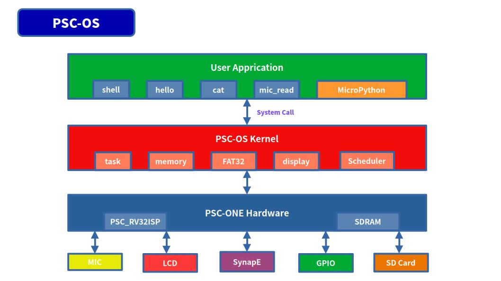

> This diagram presents the conceptual architecture of PSC-OS and PSC-ONE. Some modules shown may represent planned or experimental extensions.

Current PSC-OS features include:

- Bootloader and kernel
- Machine, Supervisor, and User privilege modes
- Sv32 virtual memory
- ECALL-based system-call interface
- Interactive command shell
- FAT32 filesystem support
- SD-card boot and storage
- User-program loading and execution
- Device drivers for UART, LCD, I2S microphone, and SD card
- Native support for the PSC-NPU and PFE hardware accelerators

PSC-OS serves both as the runtime environment for the PSC-ONE SoC and as an experimental platform for operating-system, CPU, and hardware/software co-design research.

## MicroPython on PSC-OS

MicroPython has been ported to PSC-OS and can run as a user-space application on the custom PSC_RV32 CPU.
The following console output is an excerpt from an actual execution on PSC-ONE.

```text
PSC_OS Boot Start.........
--- memset done ---
Test Ver: test_1.5.0

+--------------------------------------------------+
|                    PSC_OS                        |
|            Minimal RISC-V Kernel Boot            |
+--------------------------------------------------+
| CPU   : RV32 (Supervisor mode)
| MMU   : SV32
| UART  : SBI console or
| UART  : MMIO console
| CMD   : hello, primes, dump
| CMD   : sa_start
| CMD   : sd_read, sd_write
| CMD   : mic_read, mic_write
| CMD   : fat32_info, fat32_ls, fat32_cat
| CMD   : fat32_touch
| CMD   : speech
+--------------------------------------------------+
...
MicroPython v1.29.0-preview.727.g7de32aa1ae on 2026-08-18; minimal with unknown-cpu

>>> a = 10
>>> a * 20
200

>>> p = [n for n in range(10)]
>>> print(p)
[0, 1, 2, 3, 4, 5, 6, 7, 8, 9]

>>> print(sum(p))
45

>>> print(sum(((i%1000)*(i%1000)//((i%97)+1) for i in range(1,5000))))
88859578

>>> import math
>>> print(sum(math.sin(i) for i in range(100)))
0.37919468

>>> [print(" "*int(20+15*math.sin(i/4))+"*") for i in range(40)]
                    *
                       *
                           *
                              *
                                *
                                  *
                                  *
                                 *
                               *
                            *
                         *
                      *
                  *
              *
           *
        *
      *
     *
       *
         *
            *
               *
                   *
                       *
                          *
                             *
                                *
                                  *
                                 *
                               *
                             *
                          *
                      *
                  *
               *

>>> import psc

>>> psc.run("TEST1.PY")

Hello from SD card

10

20

2000

>>> psc.run("TEST2.PY")

=== PSC-ONE MicroPython SD Test ===

1 sin= 0.32719472 cos= 0.9800666 mix= 0.32067264

2 sin= 0.6183698 cos= 0.921061 mix= 0.5695563

3 sin= 0.841471 cos= 0.8253356 mix= 0.694496

4 sin= 0.9719379 cos= 0.6967067 mix= 0.6771557

5 sin= 0.99540792 cos= 0.5403023 mix= 0.5378212

```

This demonstrates that the PSC-ONE software stack can execute an interactive Python environment directly on the custom RISC-V processor, including integer arithmetic, list comprehensions, generators, and floating-point math functions provided by MicroPython.

---

# Demo

## PSC-OS LCD Demo

This video shows a live demonstration of the PSC system running on FPGA hardware.  
It highlights real-time interaction between the CPU, SD card interface, and UART output.  
The system successfully boots and executes software on a fully integrated hardware platform.

[](https://youtube.com/shorts/aRCHluWXozY?si=T0kp_dv_nBH07tnj)

---

## PSC-OS Boot

This video demonstrates the PSC system running `PSC-OS` on FPGA hardware after boot.  
It shows prime number computation executed on the custom `PSC_RV32` CPU, with results transmitted over UART.  
The demo highlights a fully functional hardware-software stack, from boot to program execution.

[](https://youtu.be/lV74ni7FAt4?si=_Xm8yCdqHN_oQzrs)

---

## PSC-OS Boot from SD Card

This demo uses a Kioxia 32GB SD card for storage.

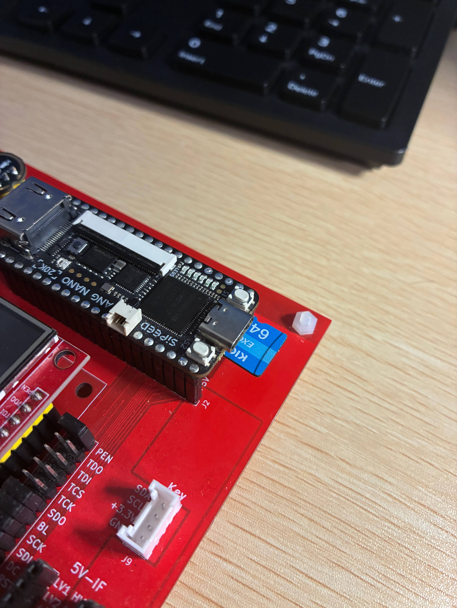

This video demonstrates the PSC system booting PSC-OS from an SD card on FPGA hardware.  
It shows the SD interface operating in serial mode, with CRC checks performed during data transfer.  
If an error is detected, the system automatically retries the read operation, ensuring reliable boot execution from external storage.  

[](https://youtu.be/FILxQiaqKrk?si=9KQKO3LVkketo0ZM)

---

# Development Status

## Hardware

### CPU
- [x] RV32I Base Integer Instruction Set
- [x] RV32M Multiply/Divide Extension
- [x] Zicsr and Zifencei Extensions
- [ ] Full Pipeline Execution
- [x] Partial Pipeline Execution for selected instruction types
- [x] Branch Instructions
- [x] Load / Store Instructions
- [x] CSR Support
- [x] ECALL / SRET Support
- [x] MMU (Sv32)
- [ ] Interrupt Controller

### Memory System
- [x] SDRAM Controller
- [x] AXI4 Memory Interface
- [x] Cache Controller
- [x] Virtual Memory Support
- [x] DMA Engine

### AI Accelerator
- [x] PSC-NPU Architecture
- [x] 4×4 INT8 Systolic Array
- [x] Matrix Multiplication API
- [x] Shared Memory Integration
- [ ] Larger Systolic Array
- [ ] Quantized Neural Network Inference

### Peripherals
- [x] UART
- [x] LED Controller
- [x] Timer
- [x] SD Card (SPI Mode, Read)
- [x] SD Card (SPI Mode, Write)
- [x] LCD Controller
- [ ] Ethernet
- [ ] USB

## Software

### PSC-OS
- [x] Bootloader
- [x] FAT32 Bootloader
- [x] Kernel
- [x] User Mode Execution
- [x] System Call Interface
- [x] Command Shell
- [x] Memory Management
- [x] SD Card Driver
- [x] SD Card Program Loader
- [x] FAT32 File System
- [ ] Networking Stack

### Device Drivers
- [x] UART
- [x] Timer
- [x] SDRAM Controller
- [x] LCD Controller (ILI9488)
- [x] I2S Microphone Interface
- [x] Systolic Array Accelerator

### Applications
- [x] Prime Number Benchmark
- [x] Matrix Multiplication Demo
- [x] SDRAM Test
- [x] SD Card Test
- [x] FAT32 File Browser (`ls`, `cat`)
- [x] FAT32 File Write
- [ ] AI Inference Demo
- [ ] Audio Processing Demo
- [ ] Speech Recognition Demo

## Verification

### Simulation
- [x] Icarus Verilog
- [x] Verilator
- [x] Cocotb Test Environment
- [x] Official RISC-V ISA tests: 49 RV32I/RV32M tests passed
- [x] SDRAM Tests
- [x] MMU Tests
- [x] PSC-OS Boot Test

### FPGA
- [x] Tang 20K
- [x] SDRAM Boot
- [x] PSC-OS Boot
- [x] UART Console
- [x] SD Card Boot
- [x] PSC-NPU Execution
- [ ] Long-Term Stability Test

## Documentation

- [x] Project Overview
- [x] Build Instructions
- [x] Simulation Guide
- [x] Hardware Architecture
- [ ] Software Architecture
- [ ] Developer Guide
- [ ] API Reference

## Future Goals

- [ ] PSC-ONE v1.0 Release
- [ ] Neural Network Inference on PSC-NPU
- [ ] Audio Recognition Demo
- [ ] Self-Balancing Robot Demo
- [ ] Custom ASIC Prototype

---

# Future Work

## Demonstration FPGA board

A demonstration FPGA board is currently under development.
Future work includes speech recognition and robotic control using the AI accelerator.

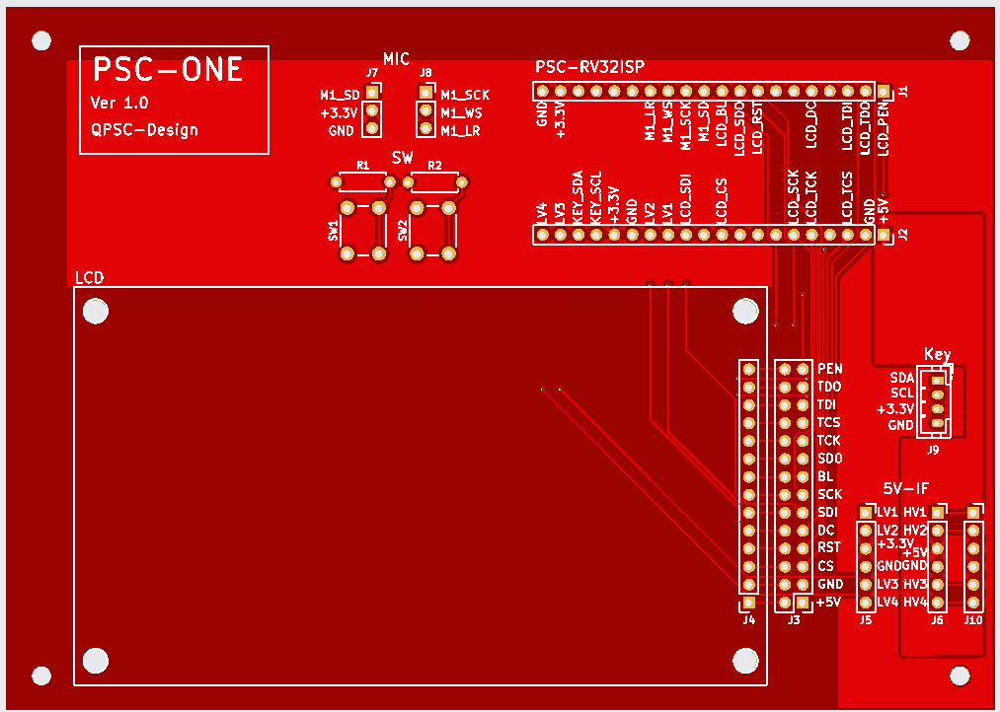

## Speech Recognition Demo

This demo showcases real-time speech recognition running on the PSC-ONE platform.  
An external microphone captures voice input, which is processed by the onboard PSC-NPU AI accelerator. The recognized text is then displayed directly on the LCD screen in real time.  

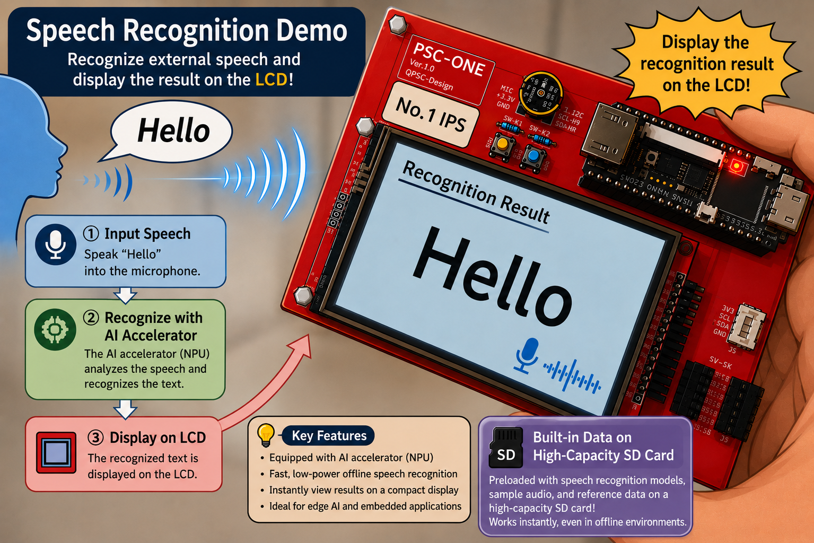

## Demonstration Robot

A demonstration of a two-wheeled self-balancing robot controlled by the PSC-ONE board is also planned

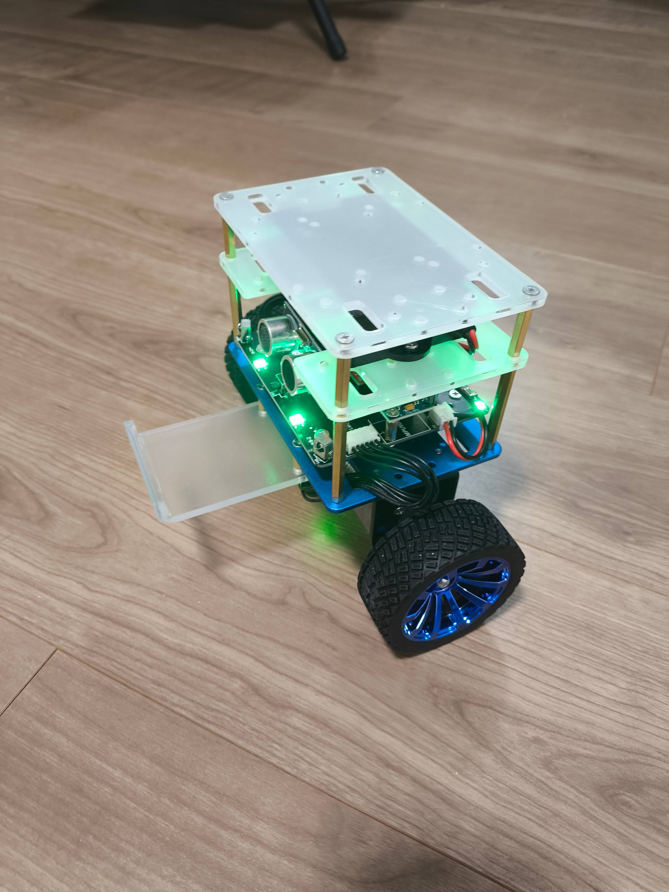

## PFE

### PSC-ONE Phase Flow Engine

The PSC-ONE Phase Flow Engine is an experimental hardware accelerator architecture developed as part of the PSC project.
It is designed for future AI, signal-processing, and data-flow computing research on the PSC-ONE platform.

Location:

```text
hardware/pfe/
```

---

# Getting Started

A more detailed setup guide will be added as the project evolves.  
At a high level, the workflow is as follows:

1. Build the hardware design
2. Program the FPGA
3. Prepare the boot image or software binaries
4. Run the system and observe output through the available interfaces

---

# Repository Status

This repository is an experimental research project
and is under active development.

RTL, software, and architecture may change frequently.

---

# License

MIT License

---

## 🚧 Work in Progress

This project is actively under development.  
Features, architecture, interfaces, and documentation may change as the design evolves.