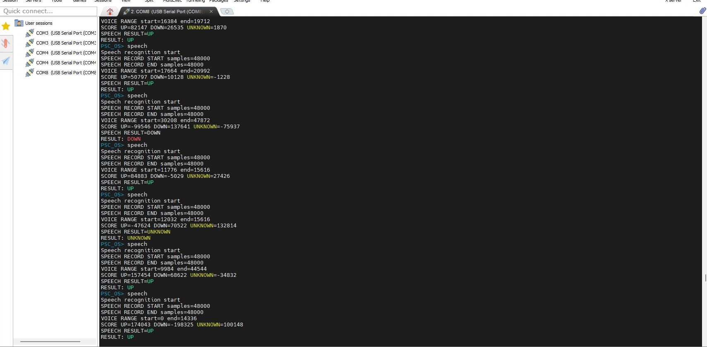
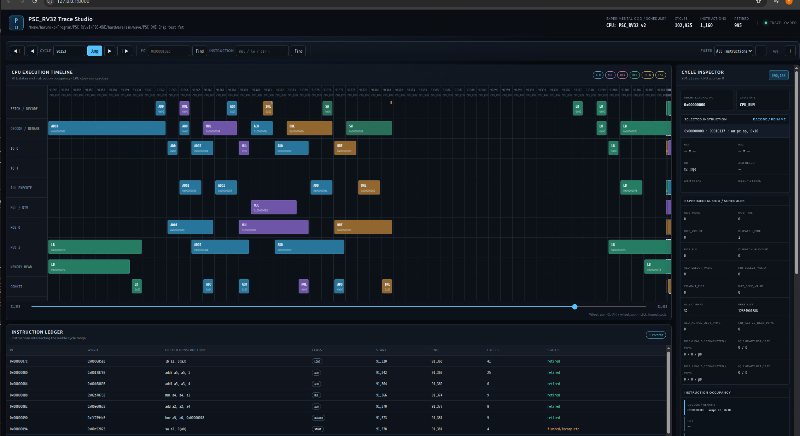

<p align="center">
  <a href="https://github.com/QPSC-Design/PSC-ONE">
    
  </a>
</p>

# PSC-ONE SoC

[日本語・開発の目的](README_JP.md) · [Documentation](docs/README.md)

An open-source full-stack RISC-V SoC platform for FPGA-based edge computing and AI acceleration.\
PSC-ONE integrates a custom CPU, memory subsystem, peripherals,
operating system, and AI accelerator into a unified architecture,
enabling end-to-end hardware/software co-design.

The PSC-NPU (SynapEngine) accelerator is controlled directly through custom
RISC-V CSR registers and accesses matrix data through the shared
cache/memory subsystem. This reduces explicit data transfers and
redundant memory copies during matrix operations and future neural-network workloads.

<!-- contents -->
- [What is PSC-ONE?](#what-is-psc-one)
- [PSC-ONE SoC Architecture](#psc-one-soc-architecture)
- [Repository Structure](#repository-structure)
- [Hardware Components](#hardware-components)
- [Software Stack](#software-stack)
- [CPU (PSC_RV32)](#cpu-psc_rv32)
- [CPU (PSC_RV32_V1)](#cpu-psc_rv32_v1)
- [CPU (PSC_RV32_V2)](#cpu-psc_rv32_v2)
- [CoreMark (CPU Core Only)](#coremark-cpu-core-only)
- [PSC-ONE AI](#psc-one-ai)
- [PSC-OS](#psc-os)
- [Demo](#demo)
- [PSC-ONE Speech Recognition Project](#psc-one-speech-recognition-project)
- [FST Viewer](#fst-viewer)
- [Development Status](#development-status)
- [Future Work](#future-work)
- [Getting Started](#getting-started)
- [Repository Status](#repository-status)
- [License](#license)
<!-- /contents -->

------------------------------------------------------------------------


The current PSC-ONE prototype hardware.\


The displayed color bars are generated directly by the PSC-ONE hardware and confirm correct operation of the LCD subsystem.


The PSC-ONE boot logo rendered on the actual FPGA hardware during system startup, demonstrating successful LCD initialization and graphics output.\


## What is PSC-ONE?

PSC-ONE is an open-source full-stack RISC-V SoC project developed by QPSC-Design.

It aims to build a fully custom edge computing platform from the ground up, including the following components:

- A custom RV32-based RISC-V CPU core
- A memory subsystem, including an SDRAM controller, caches, and an Sv32 MMU
- An SD card boot and storage interface
- Memory-mapped peripheral interfaces
- An AI acceleration engine, PSC-NPU, based on a systolic array architecture
- A custom operating system, PSC-OS

PSC-ONE is not just a CPU core, but a complete experimental SoC platform for research, edge AI development, and architectural exploration.

------------------------------------------------------------------------

## PSC-ONE SoC Architecture


This section presents the overall PSC-ONE SoC architecture, including the
PSC_RV32 CPU, memory subsystem, peripherals, PSC-OS, and PSC-ONE AI.

------------------------------------------------------------------------

## Repository Structure

| Directory | Contents |
| --- | --- |
| [hardware](hardware/README.md) | CPU/SoC RTL, bootloader and simulation |
| [software](software/README.md) | PSC-OS, MicroPython and applications |
| [board](board/README.md) | Board designs and prototype setup |
| [docs](docs/README.md) | Specifications, guides and validation records |
| [FST Viewer](tool/FST_viewer/README.md) | CPU waveform viewer |
| [IP](ip/README.md) | Project IP notes |

CPU v1 supports two PULP/CORE-V dot-product instructions. See the
[PULP specification](docs/cpu_pulp.md) ([日本語](docs/cpu_pulp_JP.md)).

------------------------------------------------------------------------

## Hardware Components

The hardware side of PSC-ONE currently includes:

- `PSC_RV32` custom RISC-V CPU core
- SDRAM controller
- SD card interface (SPI mode)
- Memory-mapped peripheral system
- PSC-NPU (SynapEngine) AI accelerator

------------------------------------------------------------------------

## Software Stack

The software side of PSC-ONE currently includes:

- `PSC-OS`, a custom operating system for the platform
- Boot and initialization flow for FPGA-based execution
- User programs and runtime experiments, including UART-based output demos

------------------------------------------------------------------------

## CPU (PSC_RV32)

### CPU Architecture


See the [CPU guide](docs/cpu.md) and [hardware overview](hardware/README.md).

------------------------------------------------------------------------

## CPU (PSC_RV32_V1)

### CPU Architecture


> Diagram note: the drawing labels the main instruction FIFO as 32 words.
> The current v1 FetchUnit defaults to 16 words; the predicted-target FIFO
> remains 8 words. The image is retained as an earlier configuration.

See the [CPU guide](docs/cpu.md) and [hardware overview](hardware/README.md).

------------------------------------------------------------------------

## CPU (PSC_RV32_V2)

### Experimental Out-of-Order Architecture


`PSC_RV32_V2` is an experimental CPU with register renaming, a reorder buffer
(ROB), and an instruction queue (IQ). The current defaults are two ROB entries,
two IQ entries, and 34 physical registers. Independent ready instructions can
execute ahead of older stalled instructions; architectural state retires in
program order. These two in-flight slots do not imply two instructions retire
per clock. See the [hardware overview](hardware/README.md) for implementation links.

See the [CPU guide](docs/cpu.md) and [hardware overview](hardware/README.md).

------------------------------------------------------------------------

## CoreMark (CPU Core Only)

CoreMark was also measured with the SDRAM/cache path removed and replaced by a 1-cycle cocotb memory model.
This isolates the CPU core from SDRAM wait states, cache misses, and refill latency.

```text
CPU       CoreMark    CoreMark/MHz    Execution Time    CRC Validation
-----------------------------------------------------------------------
cpu_v1    80.879974   0.808800        12.364 s          PASS
cpu_v2    39.987204   0.399872        12.504 s          PASS
```

Recorded measurement conditions (historical results, not rerun for this documentation update):

- 100 MHz
- GCC 14.2.0
- The original table states 500 iterations for both CPUs; this is inconsistent with the v1 score/time pair (see note below).
- 1-cycle memory response
- No SDRAM wait states
- No cache-miss or refill penalty
- Identical CoreMark binary for `cpu_v1` and `cpu_v2`
- CRC Validation: PASS

These are CPU-core-only measurements under a 1-cycle memory model.
The v1 score × execution time is approximately 1,000, whereas v2 gives 500.
The original v1 iteration count or score/time entry therefore needs confirmation
from its measurement log. Values are retained as recorded, not silently corrected.
See [CoreMark reproduction and interpretation](hardware/sim/coremark_psc/README.md).

------------------------------------------------------------------------

## PSC-ONE AI

PSC-ONE AI is a hardware accelerator platform for matrix multiplication (GEMM),
built around a custom systolic-array architecture.

It is part of the broader PSC-ONE experimental SoC platform,
which integrates:

- Custom RISC-V CPU
- Memory subsystem
- AI accelerator
- Hardware/software co-design environment

The project focuses on exploring efficient dataflow architectures
under constrained memory bandwidth for edge AI systems.

------------------------------------------------------------------------

### PSC-ONE AI Architecture


> Diagram note: “share a single multiplier” describes the shared-arithmetic
> concept. The legacy multiplier count is configurable; NPU v1 uses four
> physical multiplier lanes. The drawing is not an exact v1/v2 netlist.

The system integrates the PSC-NPU systolic array
with the PSC-ONE SoC platform.

------------------------------------------------------------------------

### PSC-ONE AI Features

- 4×4 INT8 systolic array
- Output-Stationary (OS) dataflow
- Direct control through custom RISC-V CSR registers
- Direct matrix data access through the CPU cache/memory subsystem
- Integrated with the custom PSC-RV32 processor
- Experimental hardware/software co-design platform

------------------------------------------------------------------------

### 8×8 Matrix Multiplication Performance

The following historical results compare the execution time of an 8×8 matrix multiplication across different PSC-RV32 configurations and the systolic array accelerator.

#### Execution Time Comparison

| Configuration                                  | Execution Time | Performance vs. V1 |
| ---------------------------------------------- | -------------: | -----------------: |
| PSC_RV32                                       |         591 µs |       ~1.80× faster |
| PSC_RV32_V1                                    |        1066 µs |           Baseline |
| Systolic Array                                 |          44 µs |       ~24.2× faster |
| PSC_RV32_V1 (Fetch FIFO enabled)               |         742 µs |       ~1.44× faster |
| PSC_RV32_V1 (R/I-Type pipeline enabled)        |         651 µs |       ~1.64× faster |

#### Results

The systolic array completed the 8×8 matrix multiplication in **44 µs**, approximately **24.2× faster** than the baseline PSC_RV32_V1 processor.

Enabling the Fetch FIFO reduced the PSC_RV32_V1 execution time from **1066 µs to 742 µs**. Enabling the R/I-Type pipeline further reduced it to **651 µs**, approaching the performance of the original PSC_RV32 processor at **591 µs**.

These results demonstrate that both instruction-fetch optimization and R/I-Type pipelining significantly improve CPU performance. However, the dedicated systolic array still provides a much larger performance advantage for matrix multiplication workloads.

------------------------------------------------------------------------

### PSC-NPU and PicoRV32 Resource Scale Comparison

PicoRV32 is an archived generic-cell result; its MUX count is corrected to 100
from the saved log. FF-family counts are register cells, not individual bits.
See the [CPU comparison and provenance](docs/cpu.md#psc_rv32-vs-picorv32-yosys-analysis).


#### Resource Comparison

This is a historical generic Yosys cell comparison for the legacy NPU, not
FPGA LUT/FF usage or the current NPU v1 resource count. NPU v1 has four physical
multiplier lanes; see [its implementation](hardware/rtl/soc/npu_v1/README.md).

| Metric         | PSC-NPU (4×4)        | PicoRV32 |
| -------------- | -------------------: | -------: |
| Cells          |                  555 |      515 |
| Multipliers    |                **2** |    **0** |
| Adders         |                   25 |        8 |
| Multiplexers   |                  113 |      100 |
| FF-family cells |                   88 |      105 |
| Control Logic  |             Moderate |     High |

> Multiplexer counts include Yosys `$mux` cells only and exclude `$pmux` cells.

- A **dataflow-oriented compute engine (Systolic Array)**
- A **control-oriented general-purpose CPU (PicoRV32)**

------------------------------------------------------------------------

### PSC-ONE AI Goals

This project is not intended to compete with commercial AI accelerators.

Instead, the goal is to explore:

- Dataflow-oriented accelerator design
- Memory bandwidth optimization
- Small-scale AI hardware prototyping
- Hardware/software integration techniques
- Experimental SoC architecture research

------------------------------------------------------------------------

### PSC-ONE AI Future Work

- Manufacturing a demonstration FPGA board
- Voice recognition demo using the AI accelerator
- Robot control using PSC-ONE AI
- Expansion of the systolic array architecture
- DMA and memory subsystem improvements

------------------------------------------------------------------------

## PSC-OS

[OS architecture and boot](docs/psc_os.md) · [API reference](docs/psc_os_api.md) · [MMU](docs/cpu_mmu.md)

PSC-OS is a custom operating system developed specifically for the PSC-ONE platform.

Unlike Linux, BSD, or existing RTOSes, PSC-OS is designed together with the PSC_RV32 CPU, memory subsystem, peripherals, and hardware accelerators, providing a tightly integrated hardware/software co-design environment.

The following diagram illustrates the software architecture of PSC-OS, including user applications, the kernel, device drivers, and the underlying PSC-ONE hardware platform.


> Diagram note: FAT32 is drawn inside the kernel, but the current shell/ELF path
> links FAT32 into the user image and accesses SD hardware through system calls.
> The image is retained as a conceptual overview, not a privilege-boundary map.

> This diagram presents the conceptual architecture of PSC-OS and PSC-ONE. Some modules shown may represent planned or experimental extensions.

Current PSC-OS features include:

- Bootloader and kernel
- Machine, Supervisor, and User privilege modes
- Sv32 virtual memory
- ECALL-based system-call interface
- Interactive command shell
- FAT32 filesystem support
- SD-card boot and storage
- User-program loading and execution
- Device drivers for UART, LCD, I2S microphone, and SD card
- PSC-NPU software support; PFE OS API integration remains future work

PSC-OS serves both as the runtime environment for the PSC-ONE SoC and as an experimental platform for operating-system, CPU, and hardware/software co-design research.

------------------------------------------------------------------------

### ELF Loader

PSC-OS includes an ELF loader for running RISC-V user programs from the SD card. The loader reads an ELF executable through the FAT32 filesystem, places its loadable segments in memory, and starts execution at the entry point specified by the file.
This allows user applications to be built as ELF executables instead of being converted to raw memory images. It also provides a foundation for expanding PSC-OS’s user-program support.

Example of running the sample `HELLO.ELF` from the PSC-OS shell:

```text
PSC_OS> run HELLO.ELF
ELF: entry=00400000 sp=00500000 pages=3
Hello from user ELF!
run: exit 0
PSC_OS>
```

------------------------------------------------------------------------

### MicroPython on PSC-OS

MicroPython has been ported to PSC-OS and can run as a user-space application on the custom PSC_RV32 CPU.
The following console output is an excerpt from an actual execution on PSC-ONE.

```text
PSC_OS Boot Start.........
--- memset done ---
Test Ver: test_1.5.0

+--------------------------------------------------+
|                    PSC_OS                        |
|            Minimal RISC-V Kernel Boot            |
+--------------------------------------------------+
| CPU   : RV32 (Supervisor mode)
| MMU   : SV32
| UART  : SBI console or
| UART  : MMIO console
| CMD   : hello, primes, dump
| CMD   : sa_start
| CMD   : sd_read, sd_write
| CMD   : mic_read, mic_write
| CMD   : fat32_info, fat32_ls, fat32_cat
| CMD   : fat32_touch
| CMD   : speech
+--------------------------------------------------+
...
MicroPython v1.29.0-preview.727.g7de32aa1ae on 2026-08-18; minimal with unknown-cpu

>>> a = 10
>>> a * 20
200

>>> p = [n for n in range(10)]
>>> print(p)
[0, 1, 2, 3, 4, 5, 6, 7, 8, 9]

>>> print(sum(p))
45

>>> print(sum(((i%1000)*(i%1000)//((i%97)+1) for i in range(1,5000))))
88859578

>>> import math
>>> print(sum(math.sin(i) for i in range(100)))
0.37919468

>>> [print(" "*int(20+15*math.sin(i/4))+"*") for i in range(40)]
                    *
                       *
                           *
                              *
                                *
                                  *
                                  *
                                 *
                               *
                            *
                         *
                      *
                  *
              *
           *
        *
      *
     *
       *
         *
            *
               *
                   *
                       *
                          *
                             *
                                *
                                  *
                                 *
                               *
                             *
                          *
                      *
                  *
               *

>>> import psc

>>> psc.run("TEST1.PY")

Hello from SD card

10

20

2000

>>> psc.run("TEST2.PY")

=== PSC-ONE MicroPython SD Test ===

1 sin= 0.32719472 cos= 0.9800666 mix= 0.32067264

2 sin= 0.6183698 cos= 0.921061 mix= 0.5695563

3 sin= 0.841471 cos= 0.8253356 mix= 0.694496

4 sin= 0.9719379 cos= 0.6967067 mix= 0.6771557

5 sin= 0.99540792 cos= 0.5403023 mix= 0.5378212

```

This demonstrates that the PSC-ONE software stack can execute an interactive Python environment directly on the custom RISC-V processor, including integer arithmetic, list comprehensions, generators, and floating-point math functions provided by MicroPython.

------------------------------------------------------------------------

## Demo

### PSC-OS LCD Demo

This video shows a live demonstration of the PSC system running on FPGA hardware.\
It highlights real-time interaction between the CPU, SD card interface, and UART output.\
The system successfully boots and executes software on a fully integrated hardware platform.

<a href="https://www.youtube.com/watch?v=O8GDUTijPA8">
  
</a>

------------------------------------------------------------------------

## PSC-ONE Speech Recognition Project

### Background

This speech-recognition project started from PSC-ONE.

In June 2026, I wrote **"PSC-ONEによる音声認識①（キックオフ編）"**.


About two months have passed since then.

The project has finally reached an important milestone, so the current
results are summarized here.

### Image

The PC is connected to the PSC-ONE board via UART.
Speech recognition is performed by speaking into the microphone connected to PSC-ONE,
while the recognition results are displayed on the PC through the UART console.\



### Equipment

-   PSC-ONE FPGA platform
-   Custom PSC_RV32 RISC-V CPU
-   PSC-OS
-   I2S microphone
-   PSC-NPU (SynapEngine) AI accelerator

### Results

The following output is from an actual speech-recognition test running
on PSC-ONE.

#### UP

``` text
PSC_OS> speech
Speech recognition start

（私の声でアップ）

SPEECH RECORD START samples=48000
SPEECH RECORD END samples=48000
VOICE RANGE start=0 end=32000
SCORE UP=22776 DOWN=-71191 UNKNOWN=-14509
SPEECH RESULT=UP
RESULT: UP
```

#### DOWN

``` text
PSC_OS> speech
Speech recognition start

（私の声でダウン）

SPEECH RECORD START samples=48000
SPEECH RECORD END samples=48000
VOICE RANGE start=0 end=32000
SCORE UP=-85630 DOWN=5339 UNKNOWN=-9757
SPEECH RESULT=DOWN
```

In the current implementation, speech recognition succeeds approximately
**70% of the time**.

This marks the completion of the first working PSC-ONE
speech-recognition implementation.

------------------------------------------------------------------------

## FST Viewer



PSC-ONE includes **FST Viewer (PSC_RV32 Trace Studio)**, a Python-based browser GUI for visualizing CPU execution traces generated by simulation.

The viewer reads FST/VCD waveform files and presents CPU activity at the instruction and architectural level rather than displaying only raw RTL signals. It is designed specifically for the PSC_RV32 processor family and does not require any modification to the RTL.

Currently supported CPU architectures are:

- `PSC_RV32` (legacy FSM architecture)
- `PSC_RV32_V1` (valid/ready pipeline architecture)
- `PSC_RV32_V2` (experimental out-of-order architecture)

The CPU architecture is automatically detected from the trace structure.

FST Viewer provides:

- Instruction-level execution timeline
- CPU pipeline and execution-stage visualization
- Instruction tracking across multiple cycles
- PC and instruction search
- Instruction filtering
- Instruction Ledger with PC, instruction word, disassembly, execution cycles, and retire status
- Cycle Inspector for register operands, execution results, memory accesses, hazards, and CPU state
- Architectural register display (`x0`–`x31`) with ABI names and value-change highlighting
- MUL/DIV execution and wait-state visualization
- Support for legacy, V1, and experimental V2 CPU architectures

The horizontal axis represents CPU clock cycles, allowing execution behavior to be inspected cycle by cycle.

For example, the viewer can show how an instruction moves through the CPU, how long it remains in each execution stage, when register values change, and where pipeline stalls or long-latency MUL/DIV operations occur.

The viewer runs locally using Python and a standard JavaScript/Canvas-capable web browser.

```bash
cd PSC-ONE/tool/FST_viewer
python3 fst_viewer.py
```

When no trace file is specified, the viewer automatically selects the latest FST/VCD file generated in:

```text
hardware/sim/wave/
```

A specific trace can also be opened directly:

```bash
python3 fst_viewer.py trace.fst
```

The default web interface runs on `127.0.0.1:8000`. If the port is already in use, the viewer automatically searches for the next available port.

FST Viewer is intended to make PSC_RV32 CPU development and verification easier by providing a higher-level view of processor execution than conventional waveform inspection alone.

------------------------------------------------------------------------

## Development Status

### Hardware

#### CPU
- [x] RV32I Base Integer Instruction Set
- [x] RV32M Multiply/Divide Extension
- [x] Zicsr and Zifencei Extensions
- [ ] Full Pipeline Execution
- [x] Partial Pipeline Execution for selected instruction types
- [x] Branch Instructions
- [x] Load / Store Instructions
- [x] CSR Support
- [x] ECALL / SRET Support
- [x] MMU (Sv32)
- [x] Interrupt Controller

#### Memory System
- [x] SDRAM Controller
- [x] AXI4 Memory Interface
- [x] Cache Controller
- [x] Virtual Memory Support
- [x] DMA Engine

#### AI Accelerator
- [x] PSC-NPU Architecture
- [x] 4×4 INT8 Systolic Array
- [x] Matrix Multiplication API
- [x] Shared Memory Integration
- [ ] Larger Systolic Array
- [ ] Quantized Neural Network Inference

#### Peripherals
- [x] UART
- [x] LED Controller
- [x] Timer
- [x] SD Card (SPI Mode, Read)
- [x] SD Card (SPI Mode, Write)
- [x] LCD Controller
- [ ] Ethernet
- [ ] USB

### Software

#### PSC-OS
- [x] Bootloader
- [x] FAT32 Bootloader
- [x] Kernel
- [x] User Mode Execution
- [x] System Call Interface
- [x] Command Shell
- [x] Memory Management
- [x] SD Card Driver
- [x] SD Card Program Loader
- [x] FAT32 File System
- [x] ELF Loader
- [ ] Networking Stack

#### Device Drivers
- [x] UART
- [x] Timer
- [x] SDRAM Controller
- [x] LCD Controller (ILI9488)
- [x] I2S Microphone Interface
- [x] Systolic Array Accelerator

#### Applications
- [x] Prime Number Benchmark
- [x] Matrix Multiplication Demo
- [x] SDRAM Test
- [x] SD Card Test
- [x] FAT32 File Browser (`ls`, `cat`)
- [x] FAT32 File Write
- [x] JPEG Image Viewer (jpeg) — 480×320 LCD Display
- [x] AI Inference Demo
- [x] Audio Processing Demo
- [x] Speech Recognition Demo

### Verification

#### Simulation
- [x] Icarus Verilog
- [x] Verilator
- [x] Cocotb Test Environment
- [x] Official RISC-V ISA tests: 49 RV32I/RV32M tests passed
- [x] SDRAM Tests
- [x] MMU Tests
- [x] PSC-OS Boot Test

#### FPGA
- [x] Tang 20K
- [x] SDRAM Boot
- [x] PSC-OS Boot
- [x] UART Console
- [x] SD Card Boot
- [x] PSC-NPU Execution
- [ ] Long-Term Stability Test

### Documentation

- [x] Project Overview
- [x] Build Instructions
- [x] Simulation Guide
- [x] Hardware Architecture
- [ ] Software Architecture
- [ ] Developer Guide
- [ ] API Reference

### Future Goals

- [ ] PSC-ONE v1.0 Release
- [ ] Neural Network Inference on PSC-NPU
- [ ] Extend the existing speech-recognition demo
- [ ] Self-Balancing Robot Demo
- [ ] Custom ASIC Prototype

------------------------------------------------------------------------

## Future Work

### Demonstration Robot

A demonstration of a two-wheeled self-balancing robot controlled by the PSC-ONE board is also planned


### PFE

#### PSC-ONE Phase Flow Engine

The PSC-ONE Phase Flow Engine is an experimental hardware accelerator architecture developed as part of the PSC project.
It is designed for future AI, signal-processing, and data-flow computing research on the PSC-ONE platform.

Location:

```text
hardware/rtl/soc/pfe/
```

------------------------------------------------------------------------

## Getting Started

Commands below start at the repository root (the directory containing `PSC-ONE/`).
With the RISC-V toolchain, Verilator and a Python environment containing cocotb:

```sh
cd PSC-ONE/hardware/sim
make -f Makefile.riscv.sim simulate_RISCV_TESTS_PARALLEL CPU_VERSION=v1
make -f Makefile.cpu.core simulate_CPU_CORE CPU_VERSION=v1
make -f Makefile.pscos simulate_PSCOS CPU_VERSION=v1
```

OS simulation can take a long time. See the [software guide](software/README.md)
and [board setup](board/PSC-ONE/README.md) for the next steps.

At a high level, the workflow is as follows:

1. Build the hardware design
2. Program the FPGA
3. Prepare the boot image or software binaries
4. Run the system and observe output through the available interfaces

For detailed instructions, see the [Getting Started Guide](docs/getting-started.md).

------------------------------------------------------------------------

## Repository Status

This repository is an experimental research project
and is under active development.

RTL, software, and architecture may change frequently.

------------------------------------------------------------------------

## License

MIT License

------------------------------------------------------------------------

### Work in Progress

This project is actively under development.\
Features, architecture, interfaces, and documentation may change as the design evolves.
